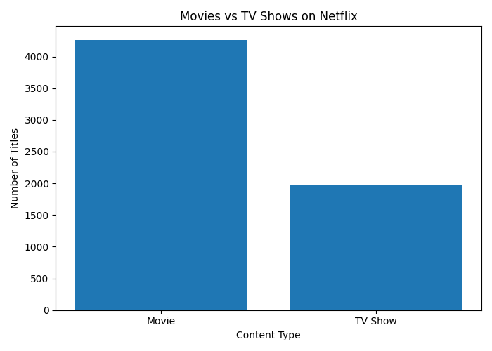
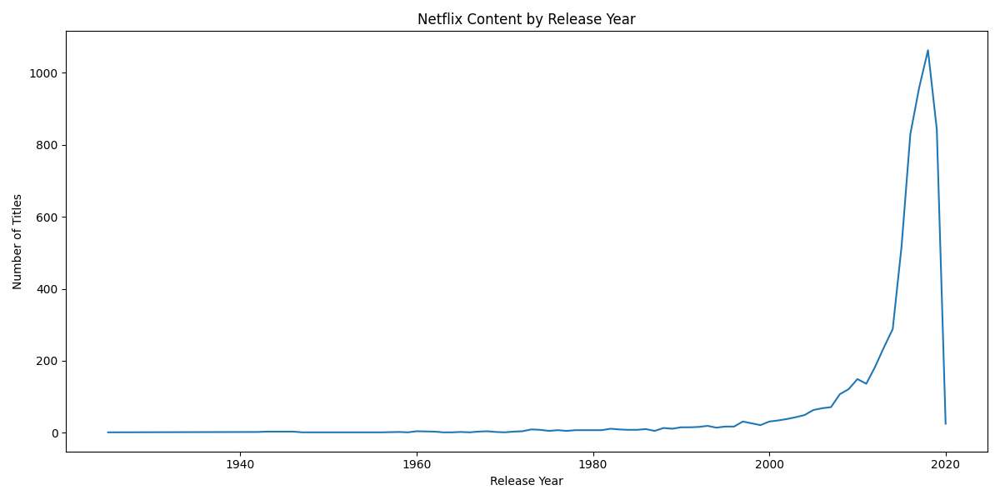
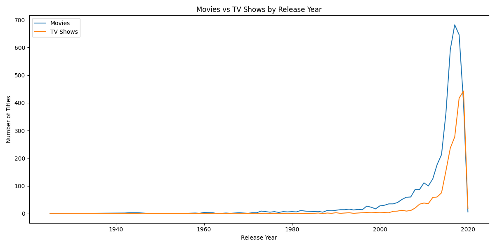
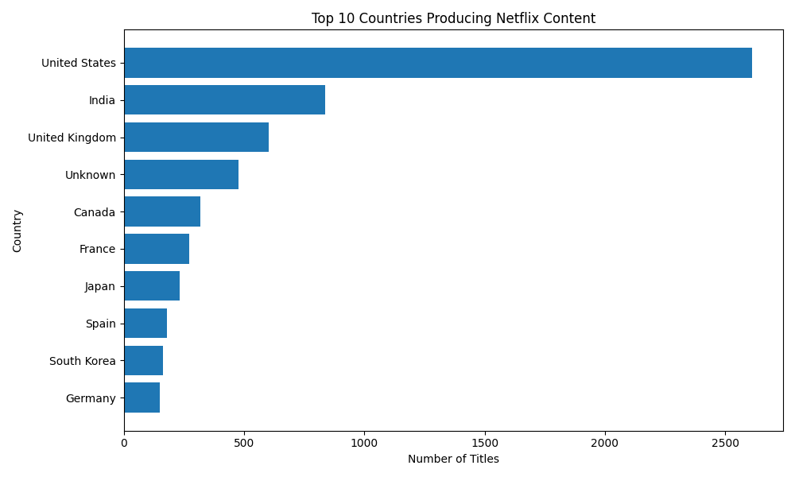
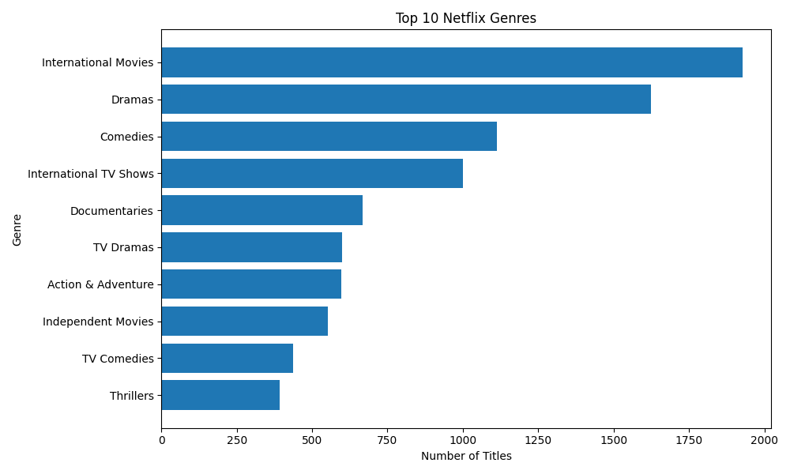

# 🎬 Netflix Data Analysis using Python

## 📌 Project Overview

This project performs exploratory data analysis on a Netflix titles dataset using **Python, Pandas, NumPy, and Matplotlib**.

The analysis explores Netflix movies and TV shows, content trends, countries, genres, ratings, and movie durations. The goal is to transform raw Netflix data into meaningful insights through data cleaning, statistical analysis, and visualization.

---

## 🎯 Project Objectives

The main objectives of this project are to:

* Analyze Netflix Movies and TV Shows
* Understand Netflix content trends over time
* Identify countries producing the most Netflix content
* Analyze the most common content ratings
* Identify the most popular Netflix genres
* Compare Movies and TV Shows across release years
* Analyze movie duration
* Practice data cleaning and exploratory data analysis using Python

---

## 🛠️ Tools & Technologies

* **Python**
* **Pandas**
* **NumPy**
* **Matplotlib**
* **Python IDLE**

---

## 📂 Dataset

The project uses the `netflix_titles.csv` dataset.

### Dataset Information

* **Rows:** 6,234
* **Columns:** 12
* **Duplicate Rows:** 0

### Main Columns

* `show_id`
* `type`
* `title`
* `director`
* `cast`
* `country`
* `date_added`
* `release_year`
* `rating`
* `duration`
* `listed_in`
* `description`

---

## 🧹 Data Cleaning

The following data preparation steps were performed:

* Checked for missing values
* Checked for duplicate records
* Removed duplicate records
* Converted `date_added` to datetime format
* Handled missing values in `director`
* Handled missing values in `cast`
* Handled missing values in `country`
* Extracted movie duration for analysis
* Split and analyzed country and genre information

---

## 📊 Analysis Performed

### 1. Movies vs TV Shows

Compared the number of Movies and TV Shows available in the dataset.

---

### 2. Netflix Content by Release Year

Analyzed how Netflix content is distributed across different release years.

---

### 3. Movies vs TV Shows by Release Year

Compared Movies and TV Shows across different release years to understand content trends over time.

---

### 4. Top 10 Countries Producing Netflix Content

Identified the countries contributing the highest number of Netflix titles.

---

### 5. Top 10 Netflix Genres

Analyzed the most frequently occurring genres/categories in the Netflix dataset.

---

### 6. Content Rating Analysis

Analyzed the distribution of Netflix content across different ratings.

---

### 7. Movie Duration Analysis

Analyzed the distribution of movie durations using statistical analysis and a histogram.

---

## 🔍 Key Business Questions

This analysis helps answer questions such as:

* Are there more Movies or TV Shows on Netflix?
* How has Netflix content changed over the years?
* How do Movies and TV Shows compare across release years?
* Which countries produce the most Netflix content?
* Which genres are most common?
* Which content ratings are most frequently used?
* What is the typical duration of Netflix movies?

---

## 💡 Skills Demonstrated

* Python Programming
* Pandas
* NumPy
* Matplotlib
* Data Cleaning
* Exploratory Data Analysis (EDA)
* Data Transformation
* Statistical Analysis
* Data Visualization
* Business Insight Generation

---

## 📁 Project Files

| File                                     | Description                           |
| ---------------------------------------- | ------------------------------------- |
| `Netflix_Data_Analysis.py`               | Complete Python analysis script       |
| `netflix_titles.csv`                     | Netflix dataset                       |
| `Netflix_Movies_vs_TV_Shows.png`         | Movies vs TV Shows visualization      |
| `Netflix_Content_by_Year.png`            | Content by release year visualization |
| `Netflix_Top_Countries.png`              | Top 10 countries visualization        |
| `Netflix_Top_Genres.png`                 | Top 10 genres visualization           |
| `Netflix_Movies_vs_TV_Shows_by_Year.png` | Movies vs TV Shows by release year    |
| `README.md`                              | Project documentation                 |

---

## 👨‍💻 Author

**Venkata Ramana Guggilapu**

Aspiring Data Analyst | SQL | Power BI | Python | Excel

📌 GitHub: [guggilapu-venkata-ramana](https://github.com/guggilapu-venkata-ramana)

📌 LinkedIn: [Venkata Ramana](https://www.linkedin.com/in/venkata-ramana-guggilapu-179008382/)

⭐ If you find this project useful, feel free to explore the repository and connect with me.
# Netflix-Data-Analysis
Netflix Data Analysis using Python, Pandas, NumPy and Matplotlib
